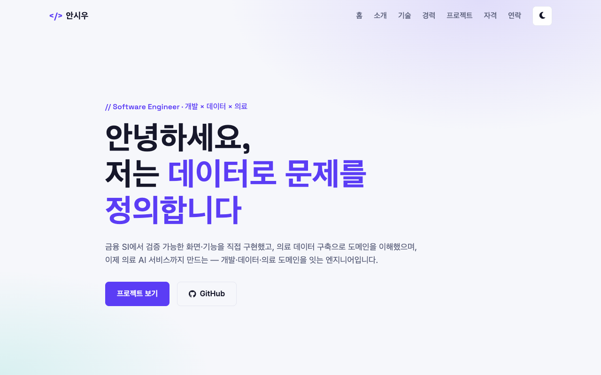
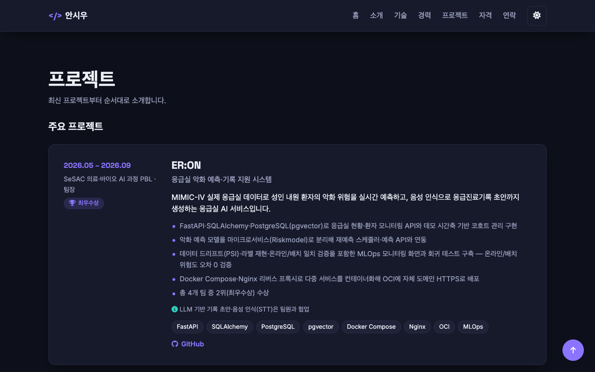
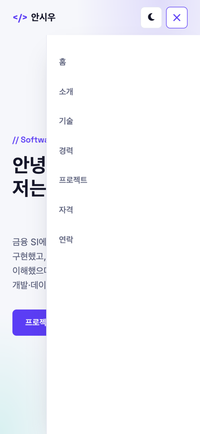

# 안시우 포트폴리오 — 나를 소개하는 웹페이지

외부 라이브러리 없이 **HTML · CSS · JavaScript**만으로 처음부터 만든 반응형 포트폴리오 웹사이트입니다.
화면을 그리는 데서 그치지 않고, **"사용자 이벤트 → 상태 변경 → DOM 업데이트"** 흐름을 기능마다 직접 구현하는 것을 목표로 했습니다.

- 금융 SI 개발 · 의료 데이터 구축 · 의료 AI 서비스 경험을 경력기술서 기반으로 소개합니다.
- GitHub API로 저장소 목록을 불러와 로딩 / 성공 / 에러 / 빈 상태를 UI로 표현합니다.

## 🔗 링크

| 구분 | URL |
| --- | --- |
| 배포 사이트 (GitHub Pages) | https://siuuu1.github.io/my-project-website/ |
| GitHub 저장소 | https://github.com/SIUUU1/my-project-website |

## 📸 스크린샷

| 데스크톱 (라이트) | 데스크톱 (다크) |
| --- | --- |
|  |  |

| 모바일 (햄버거 메뉴 열림) | 모바일 (다크) |
| --- | --- |
|  |  |

## 🧩 페이지 구성

| 섹션 | 내용 |
| --- | --- |
| Header | 로고 · 앵커 네비게이션 · 다크 모드 토글 · 햄버거 버튼 |
| Hero | 인사말 + 타이핑 효과, CTA 버튼(프로젝트 보기 / GitHub) |
| About | 자기소개, 프로필 이미지, 핵심 수치 |
| Skills | Backend · Frontend · Database · Infra/DevOps · AI/Data · 협업 도구 |
| Experience | 경력 · 교육 타임라인 (최신순) |
| Projects | 주요 프로젝트 카드(최신순) + **GitHub API 저장소 카드**(최신순, 언어 필터) |
| Certifications | 자격증 · 면허 |
| Contact | 문의 폼 (유효성 검사 + 실제 메일 전송) |
| Footer | 저작권, 소셜 링크(GitHub · 이메일) |

## 🛠 사용 기술

- **HTML5**: 시맨틱 마크업 (`header`, `nav`, `main`, `section`, `article`, `footer`)
- **CSS3**: CSS 변수(`:root`, `[data-theme="dark"]`), Flexbox, Grid(`auto-fit` + `minmax`), 모바일 퍼스트 반응형, `transition`
- **JavaScript (ES6+)**: DOM 조작, 이벤트, `fetch` + `async/await`, Intersection Observer, `matchMedia`, localStorage
- **GitHub REST API**: `https://api.github.com/users/SIUUU1/repos`
- **Web3Forms API**: 문의 폼 실제 메일 전송 (보너스)
- **Font Awesome · Google Fonts**: 아이콘, 웹 폰트 (미션에서 허용된 외부 리소스)

> React, Vue, jQuery, Bootstrap, Tailwind 등 외부 라이브러리는 사용하지 않았습니다.

## 📁 폴더 구조

```
my-project-website/
├── index.html              # 메인 페이지
├── css/
│   └── style.css           # CSS 변수 · 다크 모드 변수 · 레이아웃 · 반응형
├── js/
│   └── main.js             # DOM · 이벤트 · 상태 관리 · API 연동 · 폼 검증/전송
├── images/
│   ├── profile_image.png   # 프로필 이미지
│   ├── favicon.svg         # 파비콘
│   └── screenshots/        # README용 스크린샷
└── README.md
```

- `style.css`는 `<head>`에서, `main.js`는 **`defer`** 속성으로 연결해 HTML 파싱을 막지 않습니다.

## ✅ 요구사항 구현 현황

### 필수

| 요구사항 | 구현 내용 |
| --- | --- |
| 시맨틱 마크업 | `header` / `nav` / `main` / `section` / `footer`, 카드는 `article`로 렌더링 |
| 앵커 네비게이션 | 모든 섹션으로 이동하는 `#id` 링크 |
| 접근성 | 이미지 `alt`, `<label for>` ↔ `input id` 매칭, 아이콘 버튼 `aria-label` |
| CSS 변수 | `:root`에 색상·폰트·간격 정의, `[data-theme="dark"]`에 다크 모드 변수 별도 정의 |
| Flexbox | 네비게이션(로고 왼쪽 · 메뉴 오른쪽), 버튼 그룹, 태그 목록 |
| Grid | 저장소 카드 `repeat(auto-fit, minmax(280px, 1fr))`, 기술 스택·자격 카드, About 레이아웃 |
| 반응형 | 모바일 퍼스트, 브레이크포인트 **768px**(태블릿) · **1024px**(데스크톱), 모바일에서 햄버거 메뉴 |
| 시각 효과 | 버튼·카드 `hover` + `transition`, 카드 `box-shadow` |
| JS 코드 스타일 | `const`/`let`만 사용, `onclick` 대신 `addEventListener`, 인라인 `style` 없음 |
| 이벤트 | `click` · `submit` · `scroll` · `input` (+ `blur`, `change`) |
| 햄버거 메뉴 | `classList.toggle('active')`로 열기/닫기, 메뉴 링크 클릭 시 자동 닫힘 |
| 부드러운 스크롤 | `scrollIntoView({ behavior: "smooth" })` + CSS `scroll-behavior` |
| 스크롤 탑 버튼 | 300px 이상 스크롤 시 노출, 클릭 시 맨 위로 이동 |
| 네비 스타일 변경 | 60px 이상 스크롤 시 헤더 배경·그림자 적용 |
| 다크 모드 + 상태 유지 | 토글 시 `data-theme` 변경, localStorage 저장으로 새로고침 후 유지 |
| 스크롤 애니메이션 | Intersection Observer (`threshold: 0.2`), 한 번 나타나면 관찰 해제 |
| 폼 UX | 이름·이메일·메시지 필수값 검증, 이메일 형식 검증, 필드 바로 아래 에러 메시지, `event.preventDefault()`, 성공 메시지 |
| ES6+ | 화살표 함수, 템플릿 리터럴로 카드 HTML 생성, 구조분해 할당, `map` / `filter` / `forEach` |
| 비동기 · API | `fetch` + `async/await` + `try/catch`로 GitHub API 호출, 로딩 / 성공 / 에러(+다시 시도) / 빈 상태 UI |
| 레이트 리밋 | 403 응답 시 한도 초과 안내와 함께 에러 상태 UI 표시 |

### 보너스

| 보너스 과제 | 구현 내용 |
| --- | --- |
| 1. 프로젝트 필터링 | 저장소 언어 목록을 `Set`으로 추출해 필터 버튼 생성, `array.filter()`로 목록 갱신 |
| 2. 타이핑 효과 | Hero 문구를 한 글자씩 타이핑 → 지우기 → 다음 문구 반복 |
| 3. 폼 실제 전송 | **Web3Forms** API로 실제 이메일 전송 (Formspree와 같은 방식의 폼 전송 서비스) |
| 4. 시스템 다크 모드 감지 | `matchMedia("(prefers-color-scheme: dark)")`로 감지, OS 설정 변경 시 **실시간 반영** |

### 추가 구현

- **입력칸 이탈 시 검증**: 제출할 때뿐 아니라 `blur` 시점에도 해당 필드를 검증
- **전송 UX**: 전송 중 버튼 비활성화(중복 제출 방지), 성공 시 **토스트 알림(10초 후 자동 닫힘)**, 실패 시 폼 아래 에러 안내
- **스팸 방지**: 화면에 보이지 않는 honeypot 필드(`botcheck`)
- **최신순 정렬**: 주요 프로젝트는 `sortKey`, GitHub 저장소는 생성일(`created_at`) 기준 내림차순
- **접근성**: `prefers-reduced-motion` 설정 시 애니메이션 최소화

## ⚙️ 동작 기준값

미션에서 "자유 변경 가능하나 README에 명시"하도록 한 값들입니다. `js/main.js`의 `CONFIG` 객체에서 관리합니다.

| 항목 | 기준값 |
| --- | --- |
| 스크롤 탑 버튼 노출 | 스크롤 **300px** 이상 |
| 네비게이션 배경 변경 | 스크롤 **60px** 이상 |
| 스크롤 애니메이션 (Intersection Observer `threshold`) | **0.2** |
| 메일 전송 성공 토스트 자동 닫힘 | **10초** |

## 🔄 "상태 → 렌더링" 흐름

| # | 사용자 이벤트 | 상태 변경 | 화면 업데이트 |
| --- | --- | --- | --- |
| 1 | 다크 모드 토글 클릭 / OS 테마 변경 | 테마 상태(`data-theme`) + localStorage | 전체 색상 변수 교체, 토글 아이콘(달 ↔ 해) 변경 |
| 2 | 폼 입력 · 입력칸 이탈 · 제출 | 필드별 유효성 상태 | 에러 메시지 표시/숨김, 입력칸 테두리 강조 |
| 3 | 폼 전송 | 전송 중 / 성공 / 실패 | 버튼 비활성화 → 토스트 또는 에러 메시지 |
| 4 | 페이지 로드 → GitHub API 호출 | 로딩 / 성공 / 에러 / 빈 상태 | 스피너 → 저장소 카드 / 에러 + 다시 시도 / 빈 상태 메시지 |
| 5 | 언어 필터 버튼 클릭 | `projectState.activeLang` | 활성 버튼 표시, 저장소 목록 다시 렌더링 |

예시: GitHub API 연동 (`loadRepos`)

```js
async function loadRepos() {
  renderLoading();                        // 상태: 로딩 → 스피너 렌더링
  try {
    const response = await fetch(url);
    if (!response.ok) throw new Error(/* 403 / 404 / 기타 메시지 */);
    const data = await response.json();
    projectState.repos = data
      .filter((repo) => !repo.fork)       // 포크 제외
      .sort((a, b) => new Date(b.created_at) - new Date(a.created_at));
    renderFilters(projectState.repos);    // 상태: 성공 → 필터 버튼 + 카드 렌더링
    applyFilter();                        //   (0개면 빈 상태 렌더링)
  } catch (error) {
    renderError(error.message);           // 상태: 에러 → 메시지 + 다시 시도 버튼
  }
}
```

## 📝 설계 메모

### 시맨틱 태그와 구조 설계 기준
- 페이지 공통 영역은 `header`(로고·네비) / `main`(본문) / `footer`(저작권·소셜)로 나누고, 네비게이션은 `nav`로 감쌌습니다.
- 본문은 **네비게이션 메뉴 1개 = `section` 1개**로 설계해 앵커 링크와 1:1로 대응시켰습니다.
- 프로젝트·저장소 카드는 그 자체로 독립적인 콘텐츠라서 `article`을 사용했습니다.
- 시맨틱 태그는 스크린 리더와 검색 엔진이 문서 구조를 이해하게 하고, 코드만 봐도 영역의 역할이 드러나게 합니다.

### Flexbox vs Grid
- **Flexbox (1차원)**: 한 줄로 나열하고 정렬하는 곳에 사용했습니다. 네비게이션의 좌우 배치, 버튼 그룹, 줄바꿈되는 태그 목록이 여기에 해당합니다.
- **Grid (2차원)**: 행과 열을 함께 다루는 곳에 사용했습니다. 카드 목록은 `auto-fit` + `minmax`로 미디어 쿼리 없이도 화면 폭에 맞게 열 개수가 바뀝니다.

### 다크 모드: OS 설정 우선
- 토글 선택을 저장할 때 **선택 당시의 OS 테마**를 함께 저장합니다: `{ theme, system }`
- 새로고침 시 OS 설정이 그대로면 토글 선택을 복원하고, OS 설정이 바뀌었으면 OS 테마를 따릅니다.
- 페이지를 보는 중에 OS 테마가 바뀌면 토글 선택과 관계없이 즉시 OS 테마로 전환됩니다.

## 🚀 로컬 실행

1. 저장소를 클론하고 VS Code로 엽니다.
2. **Live Server** 확장을 설치한 뒤 `index.html`에서 우클릭 → **Open with Live Server**를 선택합니다.

## 📦 배포 (GitHub Pages)

1. 파일을 GitHub 저장소 `main` 브랜치에 push 합니다.
2. 저장소 **Settings → Pages**에서 Source를 `Deploy from a branch`, 브랜치 `main` / 폴더 `/ (root)`로 지정합니다.
3. 발급된 URL에서 반응형 레이아웃, 인터랙션, GitHub API 연동, 폼 검증·전송이 정상 동작하는지 확인합니다.

## ⚠️ 주의사항

- **GitHub API 레이트 리밋**: 인증 없이 호출하면 IP당 **시간당 60회**로 제한됩니다. 초과 시 403 응답과 함께 에러 상태 UI와 **다시 시도** 버튼이 표시되니, 짧은 시간 내 반복 새로고침은 피해 주세요.
- **Web3Forms 액세스 키**: 프론트엔드에 노출되는 것을 전제로 한 공개용 키이며, 메일은 키를 발급받은 주소로만 전송됩니다.
